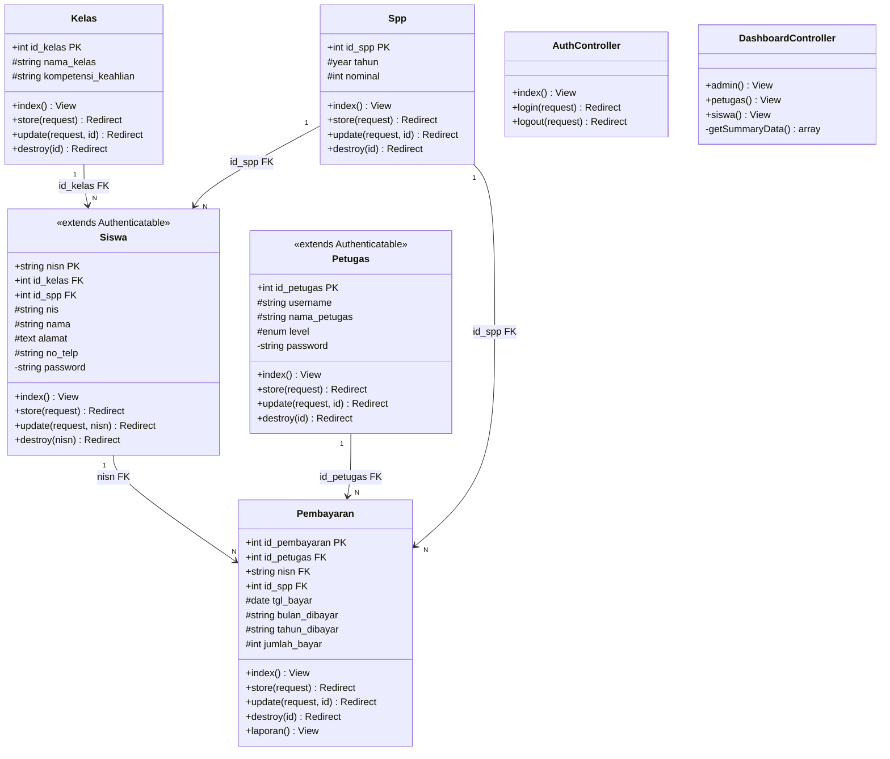

# 📐 Class Diagram - SIPAY
## Sistem Informasi Pembayaran SPP | SMKN 7 Baleendah

---

## 🔷 Format Mermaid (bisa di-render di GitHub, Notion, dll.)

---

## 📋 Deskripsi Relasi

| Dari | Ke | Tipe | FK |
|------|----|------|----|
| `Kelas` | `Siswa` | One-to-Many (1:N) | `id_kelas` |
| `Spp` | `Siswa` | One-to-Many (1:N) | `id_spp` |
| `Siswa` | `Pembayaran` | One-to-Many (1:N) | `nisn` |
| `Petugas` | `Pembayaran` | One-to-Many (1:N) | `id_petugas` |
| `Spp` | `Pembayaran` | One-to-Many (1:N) | `id_spp` |

---

## 📦 Ringkasan Class

| Class | PK | Auth Guard | Role |
|-------|----|-----------|------|
| `Kelas` | `id_kelas` | — | Master Data |
| `Spp` | `id_spp` | — | Master Data |
| `Siswa` | `nisn` (string) | `auth:siswa` | Entitas + Auth |
| `Petugas` | `id_petugas` | `auth:petugas` | Entitas + Auth |
| `Pembayaran` | `id_pembayaran` | — | Transaksi |
| `AuthController` | — | — | Controller Auth |
| `DashboardController` | — | — | Controller UI |

---

*Dibuat: 13 Juni 2026 | SIPAY v1.0 | Laravel 12 + Tailwind CSS v4*
