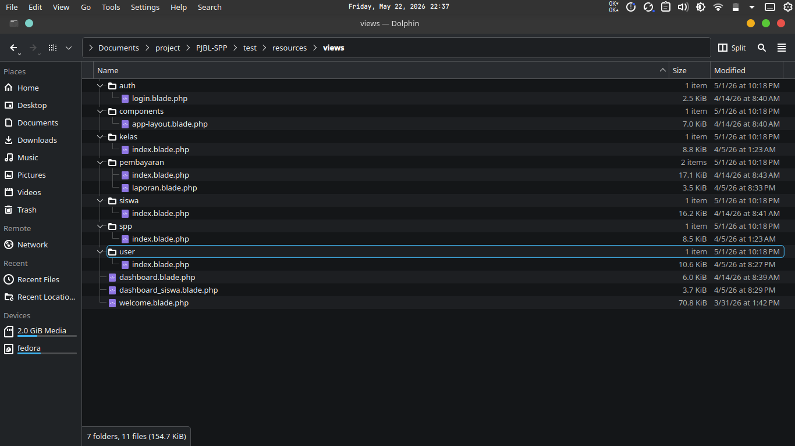

<p align="center">
    
</p>

# SIPAY - Sistem Informasi Pembayaran SPP

**SIPAY** adalah aplikasi berbasis web yang dirancang untuk mengelola administrasi pembayaran SPP sekolah secara digital, efisien, dan transparan. Proyek ini dikembangkan sebagai bagian dari Tugas **Project Based Learning (PjBL)** Kompetensi Keahlian Pengembangan Perangkat Lunak dan Gim (PPLG) di **SMK Negeri 7 Baleendah**.

Aplikasi ini menggunakan arsitektur Modern MVC dengan **Laravel 12**, mendukung otentikasi multi-role berbasis multi-guard (Admin, Petugas, dan Siswa), serta dirancang sepenuhnya menggunakan **Docker** untuk standarisasi lingkungan pengembangan.

---

## 🚀 Fitur Utama

-   **Multi-Role Authentication (Multi-Guard):** Sistem login terpisah menggunakan guard untuk tabel `petugas` (Level: Admin & Petugas) dan tabel `siswa` (menggunakan `nisn`).
-   **Manajemen Data Master (CRUD):** Pengelolaan lengkap data Siswa, Kelas, SPP, dan Petugas/Admin dengan antarmuka modal yang modern.
-   **Entry Transaksi Pembayaran:** Fitur pencatatan SPP dengan sistem *smart-autofill* nominal berdasarkan profil tahun SPP siswa untuk akurasi data.
-   **Histori Pembayaran Siswa:** Dashboard khusus siswa untuk memantau riwayat pembayaran secara mandiri.
-   **Laporan Cetak (Print-Ready):** Fitur pembuatan laporan rekapitulasi pembayaran SPP yang siap cetak dengan format resmi.
-   **Dashboard Statistik Dinamis:** Ringkasan data operasional (Total Siswa, Petugas, Kelas, SPP) dalam satu tampilan visual.
-   **Dockerized Environment:** Konfigurasi kontainerisasi instan yang memudahkan kolaborasi tim di berbagai sistem operasi.

---

## 🛠️ Tech Stack

-   **Backend:** [Laravel 12.x](https://laravel.com) (PHP 8.2+)
-   **Frontend:** [Tailwind CSS v4](https://tailwindcss.com), [Vite](https://vitejs.dev), & [Blade Templating](https://laravel.com/docs/blade)
-   **Database:** MySQL 8.0
-   **Icon & UI**: [Heroicons](https://heroicons.com)
-   **API Handling:** Axios
-   **Containerization:** Docker & Docker Compose
-   **Version Control:** Git & GitHub

---

## 👥 Anggota Tim Pengembangan (SYNTRA)

Proyek ini dibangun secara kolaboratif oleh kelompok **SYNTRA** Kelas XI PPLG-2 SMK Negeri 7 Baleendah:

| Nama Anggota | Peran / Deskripsi Tugas | Kontribusi Teknis |
| :--- | :--- | :--- |
| **Sofyan Eka Febriyanto** | Project Manager & Backend Engineer | - Arsitektur Multi-Guard Auth & Multi-Role<br>- Dockerization & Konfigurasi Lingkungan Sistem<br>- Pengembangan Logika Transaksi & Laporan |
| **Najla** | Database Designer & Frontend Developer | - Perancangan Skema Database & Migrasi<br>- Slicing UI Form Login & Dashboard Utama<br>- Implementasi Layout Master Blade |
| **Shabrina** | Frontend Engineer | - Slicing UI Manajemen Master Data (Siswa, Kelas, SPP)<br>- Implementasi Komponen Tabel & Modal Dinamis<br>- Penyesuaian Desain Responsif |
| **Ival** | Quality Assurance & Tester | - Pengujian Fungsionalitas Fitur & Validasi Form<br>- Penyusunan Skenario Uji Coba Aplikasi (UAT)<br>- Dokumentasi Teknis & Pelaporan Bug |

---

## ⚙️ Panduan Instalasi Lokal (Docker)

Ikuti langkah-langkah berikut untuk menjalankan proyek SIPAY di komputer lokal Anda:

### 1. Clone Repositori
```bash
git clone https://github.com/SofyanEkaFebriyanto/sipay.git
cd sipay
```

### 2. Konfigurasi Environment File
Salin file `.env.example` menjadi `.env`:
```bash
cp src/.env.example src/.env
```

### 3. Nyalakan Kontainer Docker
Jalankan Docker Compose untuk membangun dan menyalakan server aplikasi dan database:
```bash
docker compose up -d
```

### 4. Instal Dependensi Composer
```bash
docker exec -it sipay_app composer install
```

### 5. Generate Application Key
```bash
docker exec -it sipay_app php artisan key:generate
```

### 6. Eksekusi Migrasi & Seeder Database
```bash
docker exec -it sipay_app php artisan migrate:fresh --seed
```

Aplikasi sekarang sudah dapat diakses melalui browser pada URL: **`http://localhost:8000`**

---

## 🔑 Akun Uji Coba Default
Setelah berhasil melakukan seeder, gunakan akun berikut untuk mencoba aplikasi:
-   **Admin:** Username: `admin` | Password: `admin`
-   **Petugas:** Username: `petugas` | Password: `petugas`

---
Dikembangkan dengan ❤️ oleh Tim **SYNTRA**
